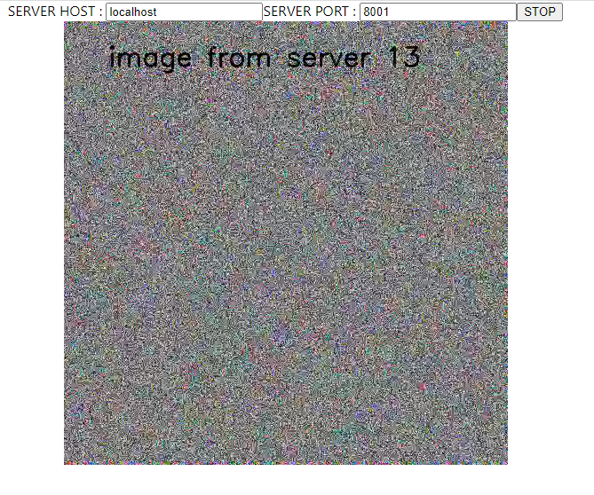

# webrtc-fastapi-react-test

Minimal webrtc streaming sample program between python server (FastAPI + aiortc) <-> React , in which python server keep returning arbitral VideoFrame image (np.randomn.rand in this sample) when requested from React client and connection is established, and client web browser keep drawing successive received images. Client side keep sending mocked imaged which obtained from mock canvas to server side.   

## reference

https://github.com/aiortc/aiortc/tree/main/examples/videostream-cli  
https://github.com/aiortc/aiortc/tree/main/examples/server  
